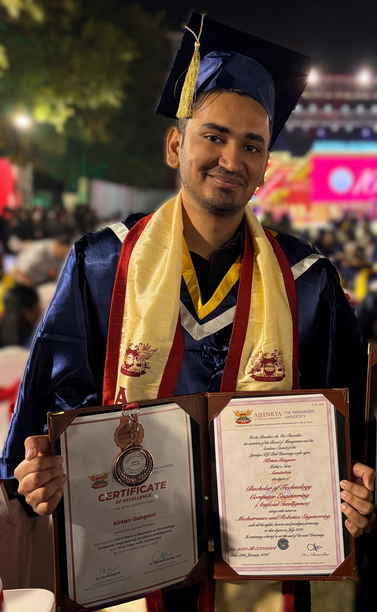

```{=html}
<div class="profile-container">
  <div class="profile-image">
    

    <div class="profile-links">
      <a href="https://github.com/KirtanGangani" target="_blank">
        
        <span class="link-text"></span>
      </a>

      <a href="https://www.linkedin.com/in/kirtan-gangani-k789/" target="_blank">
        
        <span class="link-text"></span>
      </a>

      <a href="mailto:kirtangangani789@gmail.com" target="_blank">
        
        <span class="link-text"></span>
      </a>

      <a href="https://scholar.google.com/citations?user=zAEr3WAAAAAJ&hl" target="_blank">
        
        <span class="link-text"></span>
      </a>

      <a href="files/KirtanGangani.pdf" target="_blank">
        
        <span class="link-text"></span>
      </a>
    </div>
  </div>

  <div class="profile-text">
    <p>
      I am a computer vision and machine learning researcher interested in
      vision-language models, multimodal learning, and visual reasoning.
      I completed my B.Tech in Computer Engineering from Ajeenkya DY Patil University
      with a GPA of <strong>9.41/10</strong> and a bronze medal for ranking third in
      my graduating batch.
    </p>

    <p>
      I recently worked as a Research Associate at the
      <a href="https://sustainability-lab.github.io/" target="_blank">Sustainability Lab</a>
      at IIT Gandhinagar, led by
      <a href="https://nipunbatra.github.io/" target="_blank">Prof. Nipun Batra</a>.
      My recent research has focused on understanding the capabilities and limitations
      of Vision-Language Models (VLMs) on thermal infrared imagery.
      I co-developed
      <a href="https://sustainability-lab.github.io/thermeval/" target="_blank">ThermEval</a>,
      a structured benchmark for evaluating VLMs on thermal imagery, which was accepted
      at the <strong>ACM SIGKDD Conference on Knowledge Discovery and Data Mining (KDD 2026)</strong>.
    </p>

    <p>
      My broader interests include computer vision, vision-language models,
      multimodal AI, visual reasoning, and efficient machine learning.
      I enjoy building end-to-end research systems, from dataset construction and
      evaluation pipelines to model development and experimentation. I am interested
      in pursuing graduate research at the intersection of these areas.
    </p>

    <p>
      Outside of research, I am a chess player with a peak
      <a href="https://www.chess.com/member/kirtan7311" target="_blank">Chess.com</a>
      rapid rating of 2000.
    </p>
  </div>
</div>
```

## Publications

<table>
  <tr>
    <td>KDD 2026</td>
    <td>
      <a href="https://dl.acm.org/doi/10.1145/3770855.3817469" target="_blank">
        <b>ThermEval: A Structured Benchmark for Evaluation of Vision-Language Models on Thermal Imagery</b>
      </a>
      <br>
      Ayush Shrivastava, <b>Kirtan Gangani</b>, Laksh Jain, Mayank Goel, Nipun Batra
      <br>
      <em>ACM SIGKDD Conference on Knowledge Discovery and Data Mining, 2026</em>
      <br>
    </td>
  </tr>
</table>

## Experience & Education

<table>
  <tr>
    <td>Aug 2025 – Jul 2026</td>
    <td>
      <b>Research Associate</b> at
      <a href="https://sustainability-lab.github.io/" target="_blank">Sustainability Lab</a>,
      IIT Gandhinagar
    </td>
  </tr>

  <tr>
    <td>9 May 2025 – 15 July 2025</td>
    <td>
      <b>Research Intern</b> at
      <a href="https://sustainability-lab.github.io/" target="_blank">Sustainability Lab</a>,
      IIT Gandhinagar
    </td>
  </tr>

  <tr>
    <td>2021 – 2025</td>
    <td>
      <b>B.Tech in Computer Engineering</b>, Ajeenkya DY Patil University
      <br>
      GPA: <b>9.41/10</b> · <b>Bronze Medal</b> (3rd in graduating batch)
    </td>
  </tr>
</table>
