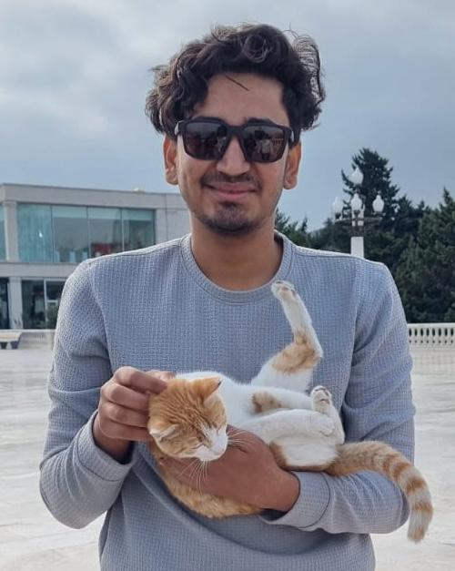

```{=html}
<div class="profile-container">
  <div class="profile-image">
    
    <div class="profile-links">
      <a href="https://github.com/KirtanGangani" target="_blank">
        
          <span class="link-text">GitHub</span>
      </a>
      <a href="https://www.linkedin.com/in/kirtan-gangani-k789/" target="_blank">
        
          <span class="link-text">LinkedIn</span>
      </a>
      <a href="mailto:kirtangangani789@gmail.com" target="_blank">
        
          <span class="link-text">Email</span>
      </a>
    </div>
  </div>
  <div class="profile-text">
    <p>
      I am a recent B.Tech graduate in Computer Engineering from Ajeenkya DY Patil University, where I completed my degree with a GPA of <strong>9.41/10</strong>. Currently, I'm a Research Associate at the <a href="https://sustainability-lab.github.io/" target="_blank">Sustainability Lab</a>, IIT Gandhinagar led by <a href="https://nipunbatra.github.io/" target="_blank">Prof. Nipun Batra</a>, where I'm applying artificial intelligence to healthcare — specifically, building vision-based systems for sleep apnea detection using thermal imagery alone, without relying on wearable sensors.
    </p>

    <p>
      My technical strengths lie in machine learning, computer vision, NLP, and large language models. I enjoy designing end-to-end ML pipelines and have worked extensively with frameworks like TensorFlow, Hugging Face Transformers, and YOLO architectures. I'm deeply motivated by research that blends practical impact with technical rigor, and I aspire to pursue a Ph.D. in Computer Science to further explore AI for real-world challenges.
    </p>

    <p>
      Outside of academics, I am a chess player with a peak <a href="https://www.chess.com/member/kirtan7311" target="_blank">Chess.com</a> rapid rating of 2000 (Top 0.5% globally).
    </p>
  </div>
</div>
```

## Publications

<table>
  <tr>
    <td>KDD 2026</td>
    <td><a href="https://sustainability-lab.github.io/thermeval/" target="_blank"><b>ThermEval: A Structured Benchmark for Evaluation of Vision-Language Models on Thermal Imagery</b></a><br>Ayush Shrivastava, <b>Kirtan Gangani</b>, Laksh Jain, Mayank Goel, Nipun Batra<br><em>ACM SIGKDD Conference on Knowledge Discovery and Data Mining, 2026</em></td>
  </tr>
</table>

## My Journey So Far

<table>
  <tr>
    <td>Aug 2025 – Present</td>
    <td>Joined as <b>Research Associate</b> at <a href="https://sustainability-lab.github.io/" target="_blank">Sustainability Lab</a>, IIT Gandhinagar</td>
  </tr>
  <tr>
    <td>9 May 2025 – 15 July 2025</td>
    <td>Successfully Completed <b>Research Internship</b> at <a href="https://sustainability-lab.github.io/" target="_blank">Sustainability Lab</a>, IIT Gandhinagar</td>
  </tr>
  <tr>
    <td>May 2025</td>
    <td>Completed B.Tech in Computer Engineering from Ajeenkya DY Patil University</td>
  </tr>
  <tr>
    <td>Aug 2021</td>
    <td>Started B.Tech in Computer Engineering at Ajeenkya DY Patil University</td>
  </tr>
</table>